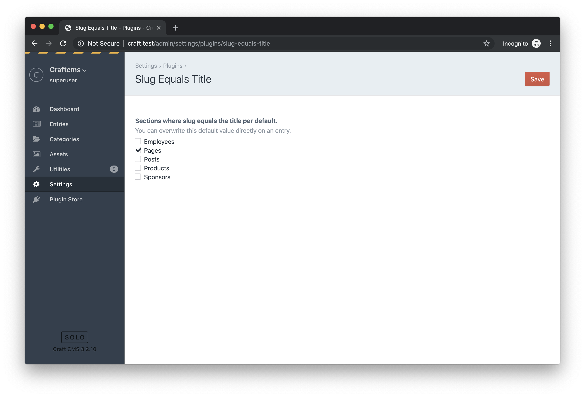
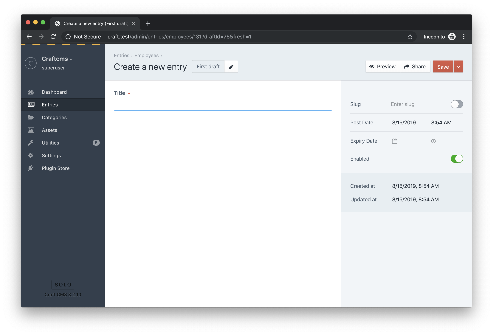
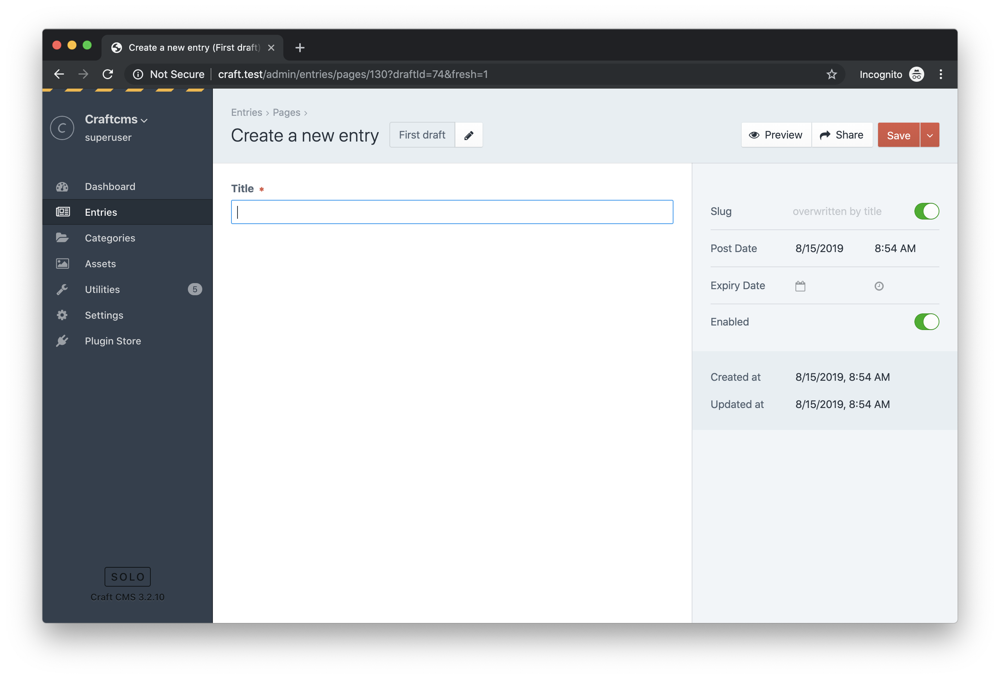

# Slug Equals Title plugin for Craft CMS 3.x

The plugin does exactly what the name says. It assures that the slug is equal to the title. 

Basically this works for every entry. By default nothing is overwritten. In the settings of the plugin you can adjust the overwriting per section. 

If the overwriting of the slugs on a section has been enabled, then this setting applies to entries which have been saved the last time before installing the plugin, or are newly created.

In practice, this means that old entries are not touched at first. But if you want to edit such an old entry, which should be overwritten by the section according to the default setting, then the existing slug will be overwritten by default. However, if the entry should keep its slug, then switch off the light switch and save the entry. Then the light switch is off when editing the entry again.

## Screenshots
Settings

New entry, that is in a section that HAS NOT BEEN flagged for overwriting.

New entry, that is in a section that HAS BEEN flagged for overwriting.

## Requirements

This plugin requires Craft CMS 3.0.0-beta.23 or later.

## Installation

To install the plugin, follow these instructions.

1. Open your terminal and go to your Craft project:

        cd /path/to/project

2. Then tell Composer to load the plugin:

        composer require internetztube/craft-slug-equals-title

3. In the Control Panel, go to Settings → Plugins and click the “Install” button for Slug Equals Title.

## Credits
Icon made by <a href="https://www.flaticon.com/authors/freepik" title="Freepik">Freepik</a> from <a href="https://www.flaticon.com/" title="Flaticon">www.flaticon.com</a> is licensed by <a href="http://creativecommons.org/licenses/by/3.0/" title="Creative Commons BY 3.0" target="_blank">CC 3.0 BY</a>

Brought to you by [Frederic Köberl](https://frederickoeberl.com)
