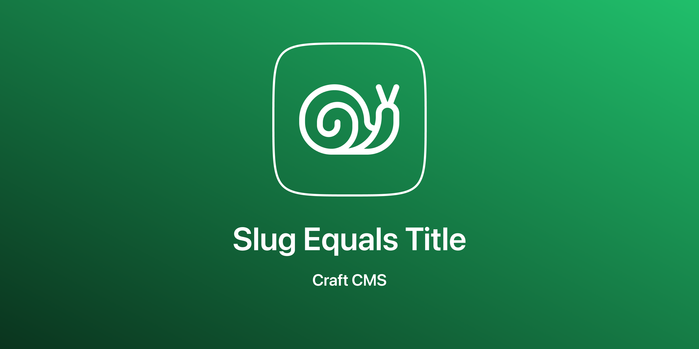

# Slug Equals Title plugin for Craft CMS 3.x

The plugin does exactly what the name says. It assures that the slug is equal to the title. 

## Requirements
This plugin requires Craft CMS 3.0.0-beta.23 or later.

## Installation
To install this plugin, follow these steps:
1. Install with Composer via `composer require internetztube/craft-slug-equals-title`
2. Install plugin in the Craft Control Panel under Settings > Plugins

You can also install this plugin via the Plugin Store in the Craft Control Panel.

## Issues
Please report any issues you find to the [Issues](https://github.com/internetztube/craft-slug-equals-title/issues) page.

## How the config works
Basically, this works for every Entry, Category or Commerce Product. By default, nothing is overwritten. In the settings of the plugin, you can adjust the overwriting per type (section, product type, category group). 

If the overwriting of the slugs on a type has been enabled, then this setting applies to elements which have been saved the last time before installing the plugin or are newly created.

In practice, this means that old elements are not touched at first. But if you want to edit such an old element, which should be overwritten by the section according to the default setting, then the existing slug will be overwritten by default. However, if the element should keep its slug, then switch off the light switch and save the element. Then the light switch is off when editing the element again.

### Supported Types
 * Entries
 * Categories
 * Commerce Products
 
## Screenshots
Settings

New element, that is in a section that HAS NOT BEEN flagged for overwriting.

New element, that is in a section that HAS BEEN flagged for overwriting.

## Credits
Icon made by <a href="https://www.flaticon.com/authors/freepik" title="Freepik">Freepik</a> from <a href="https://www.flaticon.com/" title="Flaticon">www.flaticon.com</a> is licensed by <a href="http://creativecommons.org/licenses/by/3.0/" title="Creative Commons BY 3.0" target="_blank">CC 3.0 BY</a>

Brought to you by [Frederic Köberl](https://frederickoeberl.com).
